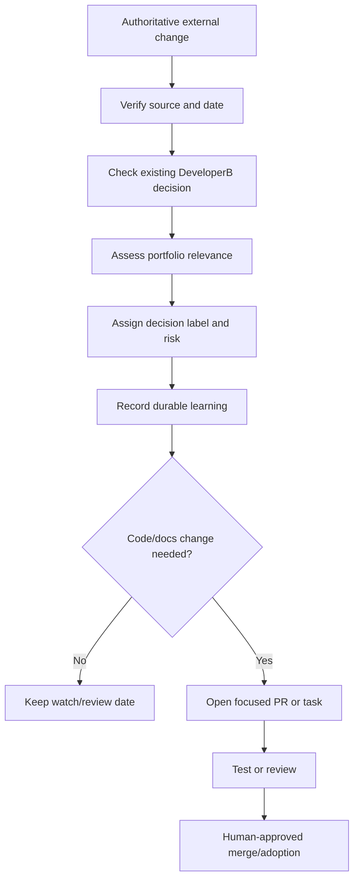

# Continuous Technology Update System

Technology changes often. DeveloperB must stay current without becoming trend-driven, unstable, or expensive to maintain.

## Simple goal

When a meaningful platform, framework, security, design, agent, automation, search, privacy, or infrastructure change appears, DeveloperB should notice it, verify it, classify its relevance, and prepare a reviewable decision.

It should **not** silently change trusted guidance or adopt technology because it is new.

## What to watch

Prioritize primary and authoritative sources for:

- Cloudflare developer documentation, changelog, blog, Workers SDK/workerd repositories;
- React, Next.js, Node.js, TypeScript, Vite and related official releases;
- GitHub platform/Actions/security and high-value open-source repositories;
- AI agents, MCP, coding tools, model/platform releases and agent infrastructure;
- databases, ORMs, authentication and authorization;
- browser/testing/observability tooling;
- UI/UX/CX, accessibility and design-system standards;
- SEO, indexing, search-engine and structured-data guidance;
- analytics, social-platform APIs/pixels/policies and email infrastructure;
- privacy/security regulators and standards bodies;
- relevant startup/product patterns when they reveal a real capability or workflow shift.

Use secondary reporting only when primary evidence is unavailable or when independent technical analysis adds material context.

## Signal filter

Do not retain an update merely because it is popular.

Keep it when it can plausibly:

- fix a security/reliability problem;
- reduce cost or repeated work;
- improve user/admin experience;
- improve observability or recovery;
- unlock a missing capability;
- simplify architecture;
- affect compliance or platform policy;
- materially change a current recommendation;
- create a credible product/business opportunity.

Ignore recycled news, rumors, trivial version churn, marketing-only claims, and technology with no plausible portfolio value.

## Decision labels

Every retained signal should receive one label:

| Label | Meaning |
| --- | --- |
| WATCH | Interesting; no action yet |
| RESEARCH | Needs deeper fit/impact analysis |
| TEST | Run a bounded non-production experiment |
| ADOPT | Approved pattern for suitable new work |
| MIGRATE | Existing systems should move after verification |
| AVOID | Known poor fit or unacceptable risk |
| NO ACTION | Understood but irrelevant now |

Record why the label was chosen and what evidence would change it.

## Safe update flow

## What every technology update record should include

- What changed
- Source and publication/release date
- Checked date
- Why it matters
- Affected project(s) or project types
- Risk/opportunity
- Confidence
- Decision label
- Required test/migration if any
- Cost/security/privacy impact where relevant
- Previous DeveloperB decision being confirmed or superseded

## Open-source/repository gate

Before recommending a new repository, package, starter, MCP server, agent framework, or automation tool, inspect:

- license;
- maintenance/release activity;
- maintainer/community health;
- known security concerns;
- dependency footprint;
- compatibility with the intended runtime;
- operational burden;
- data/privacy implications;
- migration/exit cost;
- whether existing/native functionality already solves the problem.

Do not copy a project merely because it is popular. Learn from architecture and patterns while respecting license and protected expression.

## Risk levels

| Level | Meaning | Action |
| --- | --- | --- |
| Low | Small documentation/example improvement | Review normally |
| Medium | Behavior, command, workflow, cost, or recommendation changed | Test before adoption |
| High | Security, breaking change, deprecation, legal/privacy, pricing, auth, production runtime, or destructive migration impact | Explicit human review required |

## What AI may do

AI may:

- scan current authoritative sources;
- summarize meaningful changes;
- compare new evidence with existing decisions;
- identify affected projects;
- suggest bounded experiments;
- propose documentation or code changes;
- create draft/focused PRs;
- mark unclear areas for review.

AI must not:

- auto-merge consequential technology updates;
- invent features, release details, pricing, compatibility, or legal requirements;
- treat preview/beta features as production-safe by default;
- automatically rewrite working architecture because a new tool appeared;
- create uncontrolled scraping/import/publishing loops;
- hide uncertainty or source quality.

## Daily learning loop

A high-signal daily scan should retain fewer strong items rather than many weak ones.

End each useful scan with 1–3 durable lessons. A durable lesson should be a reusable principle, not a copy of a news headline.

Examples:

- isolate autonomous execution instead of only reducing permissions;
- treat cost telemetry as operational telemetry;
- route AI tasks by complexity rather than using one expensive model everywhere;
- prefer retrieval of relevant evidence over repeatedly sending an entire knowledge base;
- keep human approval for irreversible or high-consequence actions.

When a lesson becomes stable and broadly useful, promote it into the appropriate DeveloperB standard instead of leaving it only in a daily report.

## Beginner rule

A new technology is not automatically required.

If a feature is new, experimental, beta, expensive, operationally complex, or only useful at scale, DeveloperB must say so clearly and provide the simpler default first.
